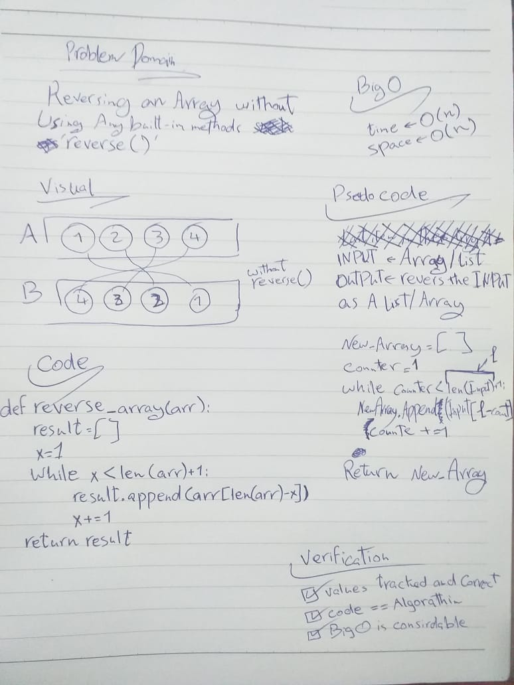
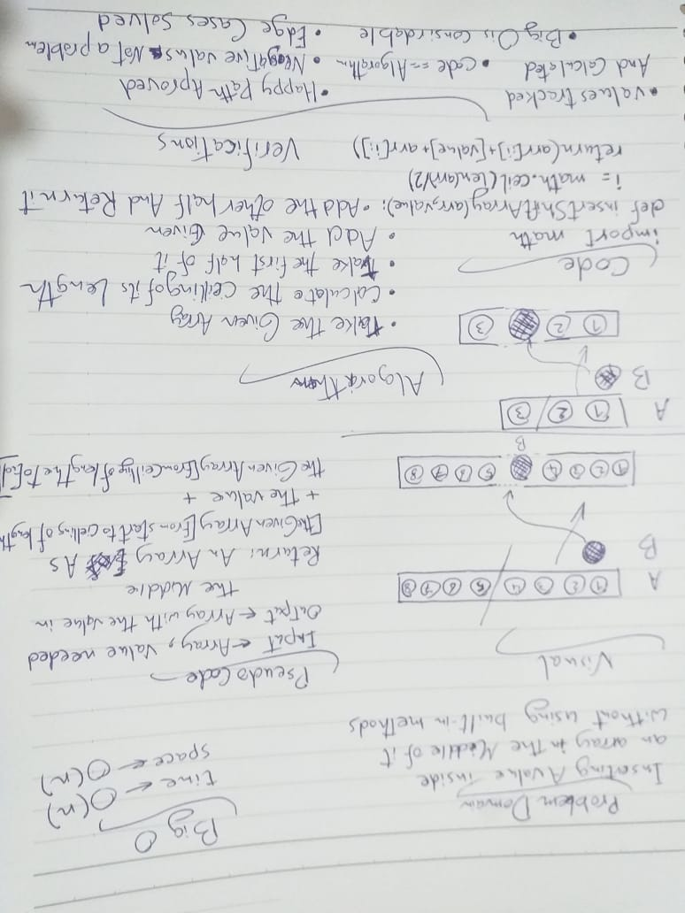

# Challenges

| **Number** | **Name and Link** |
|------------|-------------------|
| *Challenge01* |[Reverse an Array](https://github.com/Hadeaji/data-structures-and-algorithms/blob/master/data_structures_and_algorithms/challenges/array_reverse/array_reverse.py)|
| *Challenge02* |[Array Shift](https://github.com/Hadeaji/data-structures-and-algorithms/blob/master/data_structures_and_algorithms/challenges/array_shift/array_shift.py)|
| *Challenge03* |[Array Shift](https://github.com/Hadeaji/data-structures-and-algorithms/blob/master/data_structures_and_algorithms/challenges/array_binary_search/array_binary_search.py)|
| *Challenge04* |[Singly Linked List](https://github.com/Hadeaji/data-structures-and-algorithms/blob/master/data_structures_and_algorithms/data_structures/linked_list/linked_list.py)|

# 1- Reverse an Array
reversing the list items in order

## Challenge
reversing a list without using the built-in command `reverse()`

## Approach & Efficiency
reversing the items by using insert or using the nested loops.
time=>O(n) space=>O(n)

## Solution

----------------------------------------------------------------------

# 2- Array Shift
Inserting a the given value in the middle of a given array and returnning it

## Challenge
Inserting a the given value in the middle of a given array and returnning it without using built-in commands sucj as `insert()`

## Approach & Efficiency
calling the first half of the array then appending the value then calling the other half of it
time=>O(n) space=>O(n)

## Solution

----------------------------------------------------------------------

# 3- Singly Linked List
Type of Data structure application where data in the list are considered to be nodes, each node have its value and a refarence to the next node in the list
and the fist node in the list called head

## Challenge
writing a class function that create linked lists can be used ti insert,search and print it without using build-in methods

## Approach & Efficiency
for the insert it will be an if statment if there is items or not yet in the LL
for the search it is a while loop and the str loops over the items
time=>O(n) space=>O(n)

## API
created the class to create the node inside the linked list
for the insert it will create a node sets the next value as the head value and resets the head
for the search it is a while loop as long as the current equal True
and the str loops over the items and print them 