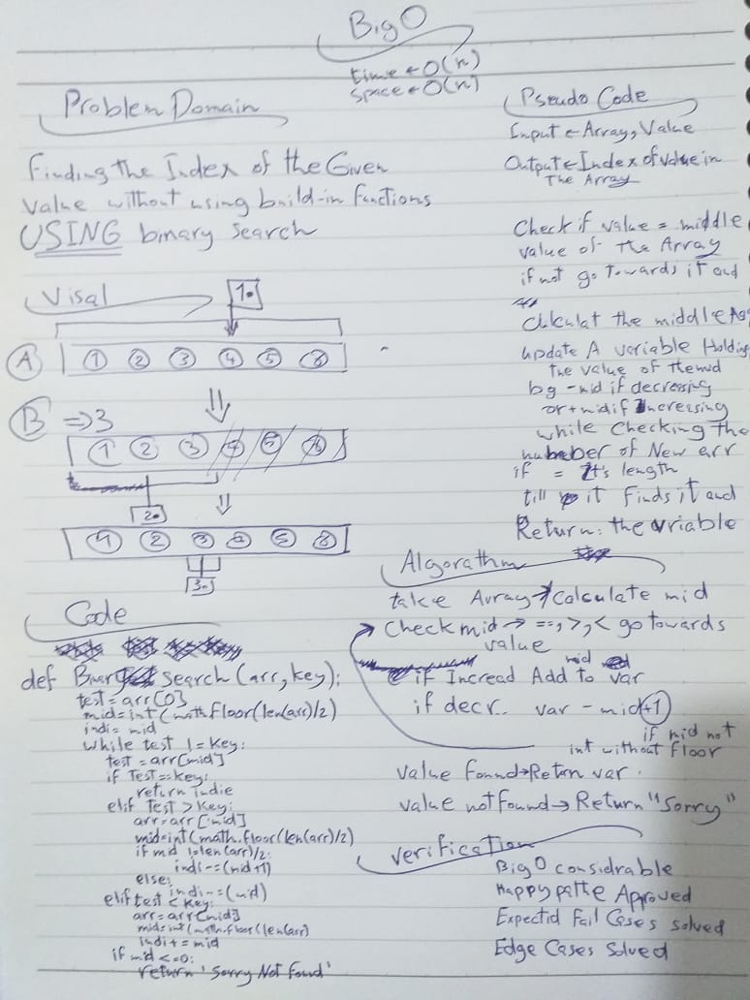
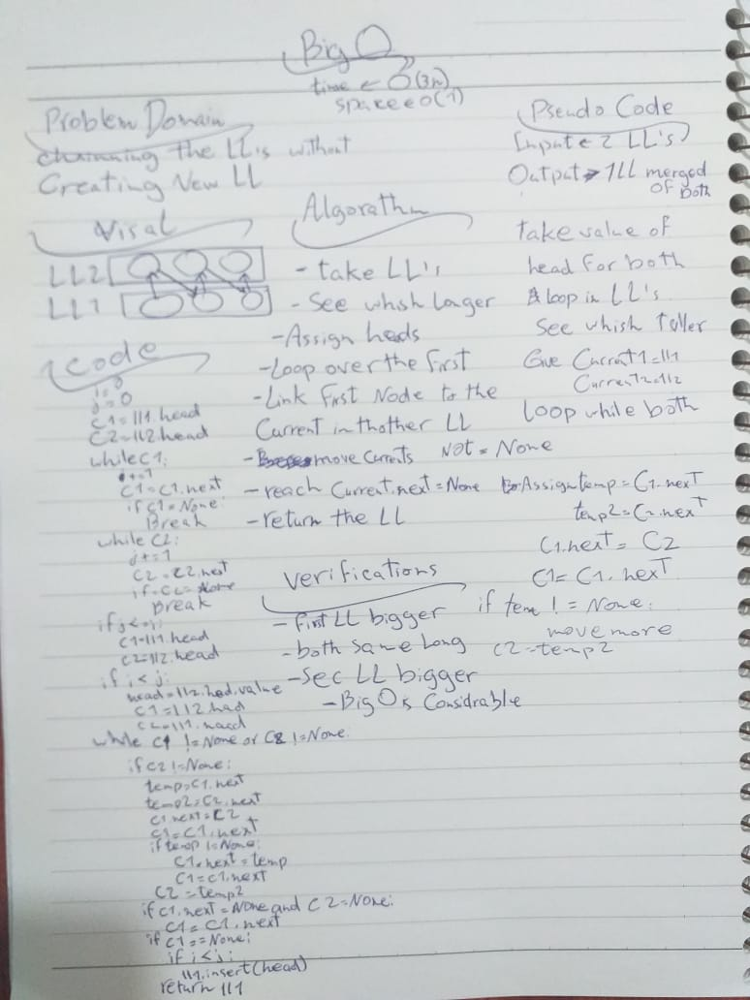
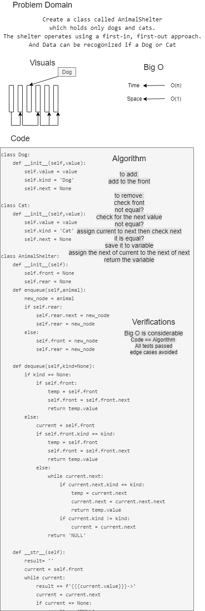

# Challenges

| **Number** | **Name and Link** |
|------------|-------------------|
| *Challenge01* |[Reverse an Array](https://github.com/Hadeaji/data-structures-and-algorithms/blob/master/data_structures_and_algorithms/challenges/array_reverse/array_reverse.py)|
| *Challenge02* |[Array Shift](https://github.com/Hadeaji/data-structures-and-algorithms/blob/master/data_structures_and_algorithms/challenges/array_shift/array_shift.py)|
| *Challenge03* |[Array Binary Search](https://github.com/Hadeaji/data-structures-and-algorithms/blob/master/data_structures_and_algorithms/challenges/array_binary_search/array_binary_search.py)|
| *Challenge04* | **WhitBoard Exam** |
| *Challenge05* |[Singly Linked List](https://github.com/Hadeaji/data-structures-and-algorithms/blob/master/data_structures_and_algorithms/data_structures/linked_list/linked_list.py)|
| *Challenge06* |[Linked list insertions](https://github.com/Hadeaji/data-structures-and-algorithms/blob/master/data_structures_and_algorithms/data_structures/linked_list/linked_list.py)|
| *Challenge07* |[Value From The End Of LL](https://github.com/Hadeaji/data-structures-and-algorithms/blob/master/data_structures_and_algorithms/data_structures/linked_list/linked_list.py)|
| *Challenge08* |[Zip two linked lists](https://github.com/Hadeaji/data-structures-and-algorithms/blob/master/data_structures_and_algorithms/challenges/ll_zip/ll_zip.py)|
| *Challenge09* |**WhitBoard Exam**|
| *Challenge10* |[Stacks and Queues](https://github.com/Hadeaji/data-structures-and-algorithms/blob/master/data_structures_and_algorithms/data_structures/stacks_and_queues/stacks_and_queues.py)|
| *Challenge11* |[Stacks with Queues](https://github.com/Hadeaji/data-structures-and-algorithms/blob/master/data_structures_and_algorithms/data_structures/stacks_with_queues/stacks_with_queues.py)|
| *Challenge12* |[Animal Shelter](https://github.com/Hadeaji/data-structures-and-algorithms/blob/master/data_structures_and_algorithms/data_structures/fifo_animal_shelter/fifo_animal_shelter.py)|

--------------------------------------------------------------------------------------------------------------------------------------------

# 1- Reverse an Array
reversing the list items in order

## Challenge
reversing a list without using the built-in command `reverse()`

## Approach & Efficiency
reversing the items by using insert or using the nested loops.
time=>O(n) space=>O(n)

## Solution

----------------------------------------------------------------------

# 2- Array Shift
Inserting a the given value in the middle of a given array and returnning it

## Challenge
Inserting a the given value in the middle of a given array and returnning it without using built-in commands sucj as `insert()`

## Approach & Efficiency
calling the first half of the array then appending the value then calling the other half of it
time=>O(n) space=>O(n)

## Solution

----------------------------------------------------------------------

# 3- Array Binary Search
Searching In an array for the index of a value with the binary search method

## Challenge
Searching In an array for the index of a value with the binary search method without using any build-in functions

## Approach & Efficiency
finding the middle point of the array the checking if the value == or < ot > from the value of  the middle then moving toward the value using the same method over and over again till it finds it
time=>O(n) space=>O(n)

## Solution

----------------------------------------------------------------------

# 5- Singly Linked List
Type of Data structure application where data in the list are considered to be nodes, each node have its value and a refarence to the next node in the list
and the fist node in the list called head

## Challenge
writing a class function that create linked lists can be used ti insert,search and print it without using build-in methods

## Approach & Efficiency
for the insert it will be an if statment if there is items or not yet in the LL
for the search it is a while loop and the str loops over the items
time=>O(n) space=>O(n)

## API
created the class to create the node inside the linked list
for the insert it will create a node sets the next value as the head value and resets the head
for the search it is a while loop as long as the current equal True
and the str loops over the items and prints them

----------------------------------------------------------------------

# 6- Linked list insertions
Inserting to a linked list using diffrent kind of methods in order to insert new nodes in the desired spot

## Challenge Description
writing some methods to insert to the linked list before or after or at the end of a list without using built-in functions

## Approach & Efficiency
for before and after it will be a loop to search for the item then insert before or after it
and to insert at the end it will loop to the end of the LL then insert the node
time=>O(n) space=>O(n)

## API
for before and after it will be a loop to search for the item then change the .next value for both the new item and the current item to insert before or after it
and to insert at the end it will loop to the end of the LL then insert the node and change the .next for the current item

----------------------------------------------------------------------

# 7- Value From The End Of LL
Finding the value of a giving Index starting from the last item

## Challenge Description
Implement a function that finds a value from a LL starting the index numbering from the last item to the first

## Approach & Efficiency
To do so I looped over the LL then converting it to normal list then reversed the list
time=>O(2n) space=>O(n)

## API
I looped over the LL then converting it to normal list by assigning the values to a variable then reversed the list using basic method then called the item using the index value given

----------------------------------------------------------------------

# 8- Zip two linked lists
Chainning the LL's by taking 1 value from each repetedly and link then togather

## Challenge Description
channing the linked lists without using helper functions or creating new LL

## Approach & Efficiency
To do so I looped till both the LL's reachs None while appending items
time=>O(2n) space=>O(1)

## API
To do so I looped till both the LL's reachs None while appending items

----------------------------------------------------------------------

# 10- Stacks and Queues
A stack is a data structure that consists of Nodes. Each Node references the next Node in the stack, but does not reference its previous.

A queue is an ordered collection of items where the addition of new items happens at one end, called the rear

## Challenge
Write queue and stack classes with their methods

## Approach & Efficiency

Create a Stack class contains:

- Define a method called push big O(1)
- Define a method called pop big O(1)
- Define a method called peek big O(1)

Create a Queue class:

- Define a method called enqueue big O(1)
- Define a method called dequeue big O(1)
- Define a method called peek big O(1)

## API
Create a Stack class contains:

- push that append new node to the end by reseting the top value
- pop that remove the top from the stack and return the value and set the top vale to the top.next
- peek that returns the top value without removing it

Create a Queue class:

- enqueue append new node to the end by using the rear and set the next value to it then set the rear
- dequeue removes the front value returns itand set the front to the next of it
- peek return the value of the front

----------------------------------------------------------------------

# 11- PseudoQueue
Implement a Queue using two Stacks.

## Challenge Description
utilaize 2 stacks to Implement a Queue methods using first-in, first-out approach.

## Approach & Efficiency
In the enqueue add to the top of the first stack, time=>O(1) space=>O(1)

In the dequeue used 2 loops and copied stack 2 to a variable, time=>O(2n) space=>O(n)

## API
In the enqueue add to the top of the first stack simple as that

In the dequeue pop for the num of the items in the s1 pop them and push them to the empty s2 resulting in a reversed s1 in the s2

after that save the value of poping from s2

pop the rest of the s2 to s1

then return the saved value

in case there is no items in s1 send the error message

----------------------------------------------------------------------

# 12- Animal Shelter
Create a class called AnimalShelter which holds only dogs and cats. The shelter operates using a first-in, first-out approach.
And Data can be recogonized if a Dog or Cat

## Challenge Description
Implement the following methods:
enqueue(animal): adds animal to the shelter. animal can be either a dog or a cat object.
dequeue(pref): returns either a dog or a cat. If pref is not "dog" or "cat" then return null.

So when you dequeue(Dog) a Dog should go out of the Queue in the Queue order

## Approach & Efficiency
for enqueue(animal) it is a normal enqueue just appends to the Queue
for dequeue(pref) it will check for front if not it will loop on current.next till if finds it

## Solution

