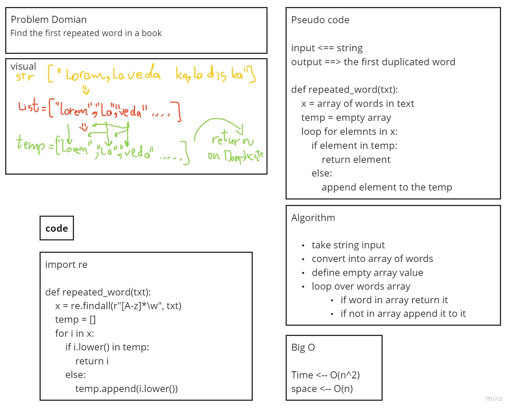

# Challenges

| **Number** | **Name and Link** |
|------------|-------------------|
| *Challenge01* |[Reverse an Array](https://github.com/Hadeaji/data-structures-and-algorithms/blob/master/data_structures_and_algorithms/challenges/array_reverse/array_reverse.py)|
| *Challenge02* |[Array Shift](https://github.com/Hadeaji/data-structures-and-algorithms/blob/master/data_structures_and_algorithms/challenges/array_shift/array_shift.py)|
| *Challenge03* |[Array Binary Search](https://github.com/Hadeaji/data-structures-and-algorithms/blob/master/data_structures_and_algorithms/challenges/array_binary_search/array_binary_search.py)|
| *Challenge04* | **WhitBoard Exam** |
| *Challenge05* |[Singly Linked List](https://github.com/Hadeaji/data-structures-and-algorithms/blob/master/data_structures_and_algorithms/data_structures/linked_list/linked_list.py)|
| *Challenge06* |[Linked list insertions](https://github.com/Hadeaji/data-structures-and-algorithms/blob/master/data_structures_and_algorithms/data_structures/linked_list/linked_list.py)|
| *Challenge07* |[Value From The End Of LL](https://github.com/Hadeaji/data-structures-and-algorithms/blob/master/data_structures_and_algorithms/data_structures/linked_list/linked_list.py)|
| *Challenge08* |[Zip two linked lists](https://github.com/Hadeaji/data-structures-and-algorithms/blob/master/data_structures_and_algorithms/challenges/ll_zip/ll_zip.py)|
| *Challenge09* |**WhitBoard Exam**|
| *Challenge10* |[Stacks and Queues](https://github.com/Hadeaji/data-structures-and-algorithms/blob/master/data_structures_and_algorithms/data_structures/stacks_and_queues/stacks_and_queues.py)|
| *Challenge11* |[Stacks with Queues](https://github.com/Hadeaji/data-structures-and-algorithms/blob/master/data_structures_and_algorithms/data_structures/stacks_with_queues/stacks_with_queues.py)|
| *Challenge12* |[Animal Shelter](https://github.com/Hadeaji/data-structures-and-algorithms/blob/master/data_structures_and_algorithms/data_structures/fifo_animal_shelter/fifo_animal_shelter.py)|
| *Challenge13* |[Multi-bracket Validation](https://github.com/Hadeaji/data-structures-and-algorithms/blob/master/data_structures_and_algorithms/data_structures/multi_bracket_validation/multi_bracket_validation.py)|
| *Challenge14* | **WhitBoard Exam** |
| *Challenge15* |[Trees](https://github.com/Hadeaji/data-structures-and-algorithms/blob/master/data_structures_and_algorithms/data_structures/tree/tree.py)|
| *Challenge16* |[Maximum Value](https://github.com/Hadeaji/data-structures-and-algorithms/blob/master/data_structures_and_algorithms/data_structures/tree/tree.py)|
| *Challenge17* |[Breadth First](https://github.com/Hadeaji/data-structures-and-algorithms/blob/master/data_structures_and_algorithms/data_structures/tree/tree.py)|
| *Challenge18* |[FizzBuzz Tree](https://github.com/Hadeaji/data-structures-and-algorithms/blob/master/data_structures_and_algorithms/challenges/fizz_buzz_tree/fizz_buzz_tree.py)|
| *Project* | **too many numbers skipped** |
| *Challenge26* |[Insertion Sort](https://github.com/Hadeaji/data-structures-and-algorithms/blob/master/data_structures_and_algorithms/challenges/insertion_sort/insertion_sort.py)|
| *Challenge27* |[Merge Sort](https://github.com/Hadeaji/data-structures-and-algorithms/blob/master/data_structures_and_algorithms/challenges/merge_sort/merge_sort.py)|
| *Challenge28* |[Quick Sort](https://github.com/Hadeaji/data-structures-and-algorithms/blob/master/data_structures_and_algorithms/challenges/quick_sort/quick_sort.py)|
| *Challenge29* | **WhitBoard Exam** |
| *Challenge30* |[Hash Tables](https://github.com/Hadeaji/data-structures-and-algorithms/blob/master/data_structures_and_algorithms/data_structures/hashtable/hashtable.py)|
| *Challenge31* |[Repeated Word](https://github.com/Hadeaji/data-structures-and-algorithms/blob/master/data_structures_and_algorithms/challenges/repeated_word/repeated_word.py)|
| *Challenge32* |[Tree Intersection](https://github.com/Hadeaji/data-structures-and-algorithms/blob/master/data_structures_and_algorithms/challenges/tree_intersection/tree_intersection.py)|
| *Challenge33* |[LeftJoin](https://github.com/Hadeaji/data-structures-and-algorithms/blob/master/data_structures_and_algorithms/challenges/left_join/left_join.py)|
--------------------------------------------------------------------------------------------------------------------------------------------

# 1- Reverse an Array
reversing the list items in order

## Challenge
reversing a list without using the built-in command `reverse()`

## Approach & Efficiency
reversing the items by using insert or using the nested loops.
time=>O(n) space=>O(n)

## Solution

----------------------------------------------------------------------

# 2- Array Shift
Inserting a the given value in the middle of a given array and returnning it

## Challenge
Inserting a the given value in the middle of a given array and returnning it without using built-in commands sucj as `insert()`

## Approach & Efficiency
calling the first half of the array then appending the value then calling the other half of it
time=>O(n) space=>O(n)

## Solution

----------------------------------------------------------------------

# 3- Array Binary Search
Searching In an array for the index of a value with the binary search method

## Challenge
Searching In an array for the index of a value with the binary search method without using any build-in functions

## Approach & Efficiency
finding the middle point of the array the checking if the value == or < ot > from the value of  the middle then moving toward the value using the same method over and over again till it finds it
time=>O(n) space=>O(n)

## Solution

----------------------------------------------------------------------

# 5- Singly Linked List
Type of Data structure application where data in the list are considered to be nodes, each node have its value and a refarence to the next node in the list
and the fist node in the list called head

## Challenge
writing a class function that create linked lists can be used ti insert,search and print it without using build-in methods

## Approach & Efficiency
for the insert it will be an if statment if there is items or not yet in the LL
for the search it is a while loop and the str loops over the items
time=>O(n) space=>O(n)

## API
created the class to create the node inside the linked list
for the insert it will create a node sets the next value as the head value and resets the head
for the search it is a while loop as long as the current equal True
and the str loops over the items and prints them

----------------------------------------------------------------------

# 6- Linked list insertions
Inserting to a linked list using diffrent kind of methods in order to insert new nodes in the desired spot

## Challenge Description
writing some methods to insert to the linked list before or after or at the end of a list without using built-in functions

## Approach & Efficiency
for before and after it will be a loop to search for the item then insert before or after it
and to insert at the end it will loop to the end of the LL then insert the node
time=>O(n) space=>O(n)

## API
for before and after it will be a loop to search for the item then change the .next value for both the new item and the current item to insert before or after it
and to insert at the end it will loop to the end of the LL then insert the node and change the .next for the current item

----------------------------------------------------------------------

# 7- Value From The End Of LL
Finding the value of a giving Index starting from the last item

## Challenge Description
Implement a function that finds a value from a LL starting the index numbering from the last item to the first

## Approach & Efficiency
To do so I looped over the LL then converting it to normal list then reversed the list
time=>O(2n) space=>O(n)

## API
I looped over the LL then converting it to normal list by assigning the values to a variable then reversed the list using basic method then called the item using the index value given

----------------------------------------------------------------------

# 8- Zip two linked lists
Chainning the LL's by taking 1 value from each repetedly and link then togather

## Challenge Description
channing the linked lists without using helper functions or creating new LL

## Approach & Efficiency
To do so I looped till both the LL's reachs None while appending items
time=>O(2n) space=>O(1)

## API
To do so I looped till both the LL's reachs None while appending items

----------------------------------------------------------------------

# 10- Stacks and Queues
A stack is a data structure that consists of Nodes. Each Node references the next Node in the stack, but does not reference its previous.

A queue is an ordered collection of items where the addition of new items happens at one end, called the rear

## Challenge
Write queue and stack classes with their methods

## Approach & Efficiency

Create a Stack class contains:

- Define a method called push big O(1)
- Define a method called pop big O(1)
- Define a method called peek big O(1)

Create a Queue class:

- Define a method called enqueue big O(1)
- Define a method called dequeue big O(1)
- Define a method called peek big O(1)

## API
Create a Stack class contains:

- push that append new node to the end by reseting the top value
- pop that remove the top from the stack and return the value and set the top vale to the top.next
- peek that returns the top value without removing it

Create a Queue class:

- enqueue append new node to the end by using the rear and set the next value to it then set the rear
- dequeue removes the front value returns itand set the front to the next of it
- peek return the value of the front

----------------------------------------------------------------------

# 11- PseudoQueue
Implement a Queue using two Stacks.

## Challenge Description
utilaize 2 stacks to Implement a Queue methods using first-in, first-out approach.

## Approach & Efficiency
In the enqueue add to the top of the first stack, time=>O(1) space=>O(1)

In the dequeue used 2 loops and copied stack 2 to a variable, time=>O(2n) space=>O(n)

## API
In the enqueue add to the top of the first stack simple as that

In the dequeue pop for the num of the items in the s1 pop them and push them to the empty s2 resulting in a reversed s1 in the s2

after that save the value of poping from s2

pop the rest of the s2 to s1

then return the saved value

in case there is no items in s1 send the error message

----------------------------------------------------------------------

# 12- Animal Shelter
Create a class called AnimalShelter which holds only dogs and cats. The shelter operates using a first-in, first-out approach.
And Data can be recogonized if a Dog or Cat

## Challenge Description
Implement the following methods:
enqueue(animal): adds animal to the shelter. animal can be either a dog or a cat object.
dequeue(pref): returns either a dog or a cat. If pref is not "dog" or "cat" then return null.

So when you dequeue(Dog) a Dog should go out of the Queue in the Queue order

## Approach & Efficiency
for enqueue(animal) it is a normal enqueue just appends to the Queue
for dequeue(pref) it will check for front if not it will loop on current.next till if finds it

## Solution

----------------------------------------------------------------------

# 13- Multi-bracket Validation
checks if the brackets in a given 

## Challenge Description
function take a string as its only argument, and should return a boolean representing whether or not the brackets in the string are balanced

## Approach & Efficiency
function creats one Stack then while looping in the string it passes the openning brackets to the stack and for every closing one it should match the last pushed openning kind

## Solution

----------------------------------------------------------------------

# 15- Trees
A Tree is a data structure that consists of Nodes that form a tree like shape 

Binary Trees is where every node has 2 childs at max

## Challenge Description
Create a BinaryTree class
Define a method for each of the 3 depths:

- preOrder
- inOrder
- postOrder

Create a BinarySearchTree class
Define a method named add that adds a new node with value to tree.
Define a method named contains that accepts a value, and returns a boolean indicating whether or not the value is in the tree at least once.

## Approach & Efficiency
created a preOrder,inOrder and postOrder methods that uses recursion big O(2^n)

created add and contains methods that uses recursion big O(2^n) also
## API
created a preOrder,inOrder and postOrder methods
first assign empty array
then It loops over the tree by going to the root append if preorder goes to the left node if exist and use the uses recursion then append if inorder then go to right if exist and uses recursion then append if postorder

In add it will assign root if it does not exist else will assign cueent as root then check if it is eqaul bigger or smaller than the current
and add to it if not exist alse will navigate to the left or right

same method applies to contain

----------------------------------------------------------------------

# 16- Maximum Value
Find the Maximum Value in a Binary Tree

## Challenge Description
Find the Maximum Value in a Binary Tree without using buildins assuming all elements are numbers

## Approach & Efficiency
Created a value called max that is equal to the root then used one of the depth methods to itirate to tree while comparing

Big O of time --> O(2^n)
Big O of space --> O(1)

## API
Created a value called max that is equal to the root then used preOrder methods to itirate to tree Nodes values, compare with the value saved in max then replace it if it is bigger then after the recursion ends i will have the max as the really max value in the tree and will return it 

----------------------------------------------------------------------

# 17- Breadth First
Breadth-first Traversal throught the tree

## Challenge Description
Write a breadth first traversal method Without utilizing any of the built-in methods available to your language, traverse the input tree using a Breadth-first approach, and return a list of the values in the tree in the order they were encountered.

## Approach & Efficiency
Created an empty list called output that you append values of tree node when you dequeue the node you enqueued to the new queue you created at the first

Big O of time --> O(2^n)
Big O of space --> O(n)

## Solution

----------------------------------------------------------------------

# 18- fizzBuzz Tree
takes a k-ary tree as an argument 

- If the value is divisible by 3, replace the value with “Fizz”
- If the value is divisible by 5, replace the value with “Buzz”
- If the value is divisible by 3 and 5, replace the value with “FizzBuzz”
- If the value is not divisible by 3 or 5, simply turn the number into a String.

## Challenge Description
Write the fizzBuzz Tree function and apply it on the argumnt trees with using build in functions

## Approach & Efficiency
copied the tree to a variable the used the depth method to tranverse through while changing values of nodes

Big O of time --> O(2^n)
Big O of space --> O(n)

## Solution

----------------------------------------------------------------------

# 26- Insertion Sort
Insertion Sort is a sorting algorithm that traverses the array multiple times as it slowly builds out the sorting sequence

## Challenge Description
Write a function that sorts an array without using built-in methods

## Approach & Efficiency
itterates thro the array elements and comparing each one with the one after then reversing order if it applys the statment

Big O of time --> O(2^n)
Big O of space --> O(1)

## Solution

## Blog
[Insertion Sort](https://github.com/Hadeaji/data-structures-and-algorithms/blob/master/data_structures_and_algorithms/challenges/insertion_sort/BLOG.md)

----------------------------------------------------------------------

# 27- Merge Sort
Merge Sort is a Divide and Conquer algorithm. It divides the input array into two halves, calls itself for the two halves, and then merges the two sorted halves.

## Challenge Description
Write a function that sorts an array without using built-in methods

## Approach & Efficiency
Divide the input array into two halves,repeatedly till every element is alone the start comparing and merging single elements in the right order then compare the parts elements and reassign values in the part in order. using recursion.

Big O of time --> O(n*log(n))
Big O of space --> O(1)

## Solution

## Blog
[Insertion Sort](https://github.com/Hadeaji/data-structures-and-algorithms/blob/master/data_structures_and_algorithms/challenges/merge_sort/BLOG.md)

----------------------------------------------------------------------

# 28- Quick Sort
QuickSort is a Divide and Conquer algorithm. It picks an element as pivot and partitions the given array around the picked pivot

## Challenge Description
Write a function that uses Quick Sort an array without using built-in methods

## Approach & Efficiency
selecting a 'pivot' element from the array and partitioning the other elements into two sub-arrays, according to whether they are less than or greater than the pivot. The sub-arrays are then sorted recursively.

Big O of time --> O(log(n))
Big O of space --> O(1)

## Solution

## Blog
[Insertion Sort](https://github.com/Hadeaji/data-structures-and-algorithms/blob/master/data_structures_and_algorithms/challenges/quick_sort/BLOG.md)

----------------------------------------------------------------------

# 30- Hash Tables
The basic idea of a hashtable is the ability to store the key into this data structure, and quickly retrieve the value. This is done through what we call a hash. A hash is the ability to encode the key that will eventually map to a specific location in the data structure that we can look at directly to retrieve the value.

## Challenge Description
Implement a Hashtable

## Approach & Efficiency
create a list with 1024 None elements than whenever the user add a value checks if their is and element in the location other than hte none if there is not it will create a linked list and add to it else will add to the existing linked list

Big O of time --> O(1)
Big O of space --> O(1)

## API
add method that takes in both the key and value and add them to their location
get method that takes in the key and returns the value from the table.
contains method that takes in the key and returns a boolean, indicating if the key exists in the table already.
hash method that is being used by other metods to know or decide the location of the values

----------------------------------------------------------------------

# 31- Repeated Word
Find the first repeated word in a given string by comparing word by word till you find the first repeated one

## Challenge Description
Find the first repeated word in a given string.

## Approach & Efficiency
created empty array,passed string words to it one bye one while checking if the word is already there

Big O of time --> O(n^2)
Big O of space --> O(n)

## Solution

----------------------------------------------------------------------

# 32- Tree Intersection
Find common values in 2 binary trees by navigation to values and checking them

## Challenge Description
write function that finds common values in 2 binary trees without using built in methods

## Approach & Efficiency
using the one of the tranversal methods in trees getting a list of values from tree 1 and tree 2 then checking the 2 arrays for common values and appending it to an temp array then return it

Big O of time --> O(n)
Big O of space --> O(n)

## Solution

----------------------------------------------------------------------

# 33- Left Join
LEFT JOIN returns all rows from the left table, even if there are no matches in the right table. This means that if the ON clause matches 0 (zero) records in the right table; the join will still return a row in the result, but with NULL in each column from the right table

## Challenge Description
Implement a simplified LEFT JOIN for 2 Hashmaps

## Approach & Efficiency
getting keys of the first hashmap then append it with its values as any array to and empty array then for every key search if the other one caontains it if yes append the value for the array

Big O of time --> O(n^2)
Big O of space --> O(n)

## Solution

