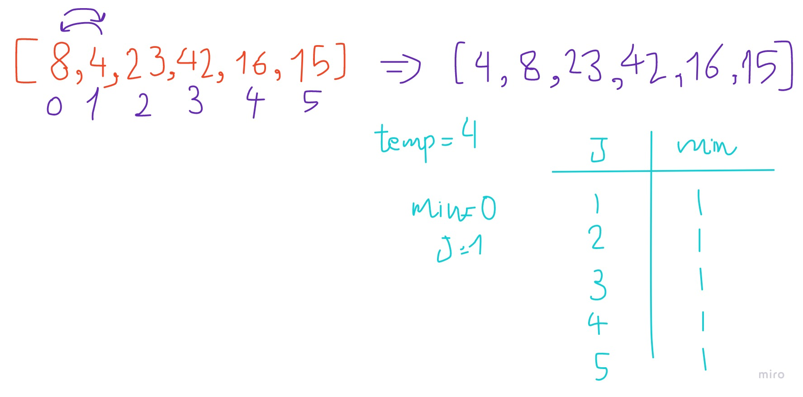
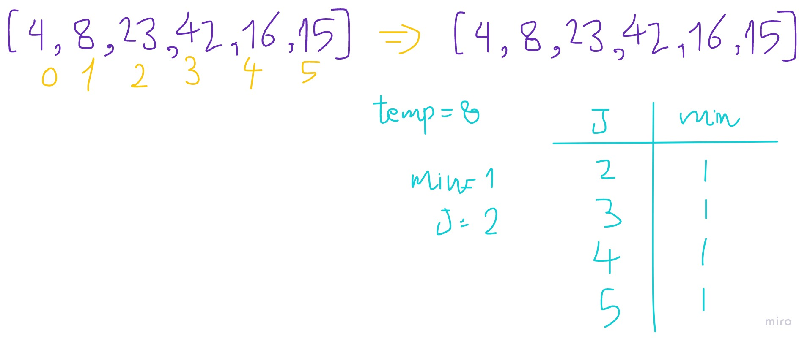
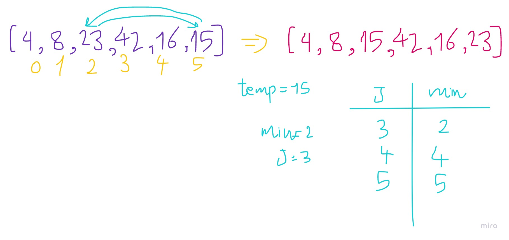
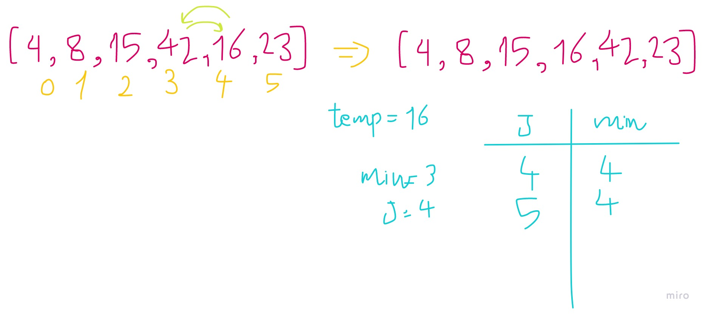
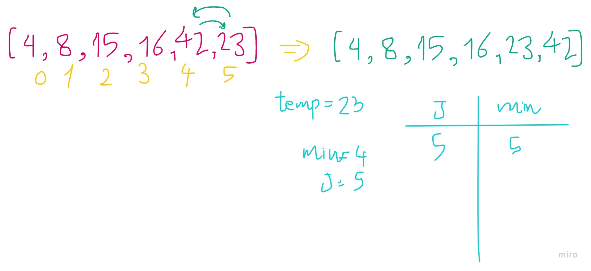

# Insertion Sort

Insertion Sort is a sorting algorithm that traverses the array multiple times as it slowly builds out the sorting sequence

so first of all you get the length of the array

inside a loop:

you assgin a variable for the index 0

then you assign a variable for the one after

then check which one is bigger and swap their locations if required

this will only swap all values by one step of they apply the statment, **so what do we do?**

you guessed it right, nested loops

just assign the variables inside the first loop and outside the next one

do the statments inside and dont forget to iterrate to next values inside the loop after the statment

Trace:

Sample array: [8,4,23,42,16,15]


example code:

```
def insertion_sort(arr):
    n = len(arr)
    for i in range(n-1):
        min_ = i
        j=i+1
        for f in range(n-1):
            if arr[j] < arr[min_]:
                min_ = j
            j +=1
            if j > n-1:
                break

        temp = arr[min_]
        arr[min_] = arr[i]
        arr[i] = temp
```







```
Basicly in this step 23 gets saved and the n compared with each value after it one by one

after cgecking it with 42 it stills the same then checks with 16 it is smaller than it so the min value changes but because we still inside the loop and there is still more numbers to test it will check them

after checking with last value (15) it is appeard to be smaller so it will change the min value, bestored in the temp and being swaped places with 23 bu assignning array index to new values 
```




