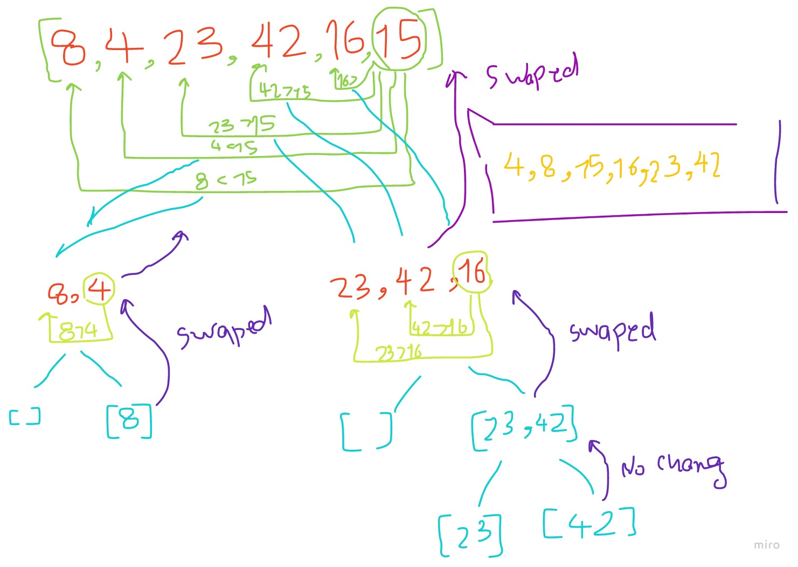

# Quick Sort

QuickSort is a Divide and Conquer algorithm. It picks an element as pivot and partitions the given array around the picked pivot.

define function that takes the array and right and left values whish are the index of first element and the last element

define variable that take part of the array which has the smaller values than the pivot using a function

the function swaps places of values that are lower and higher than the pivot

do it using recursion in the first function
by calling the main function one time for the lower values one time and calling it for the higher values one time

In Short:

we start from the leftmost element and keep track of index of smaller (or equal to) elements as i. While traversing, if we find a smaller element, we swap current element with arr[i]. Otherwise we ignore current element.

## Trace:

example code:

```
def quick_sort(arr, left, right):
    if left < right:
        position = partition(arr, left, right)
        quick_sort(arr, left, position - 1)
        quick_sort(arr, position + 1, right)

def partition(arr, left, right):
    pivot = arr[right]
    low = left - 1
    for i in range(left,right):
        if arr[i] <= pivot:
            low +=1
            swap(arr, i, low)

    swap(arr, right, low+1)
    return low + 1

def swap(arr, i, low):
    temp = arr[i]
    arr[i] = arr[low]
    arr[low] = temp

```

Sample array: [8,4,23,42,16,15]


